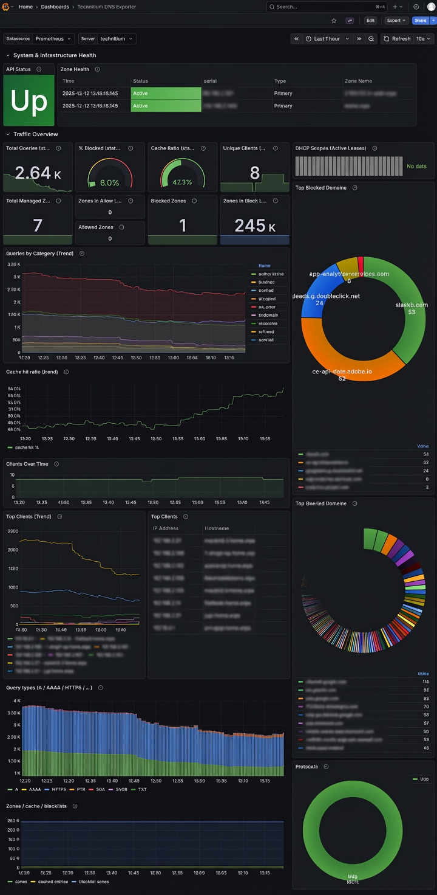

# Technitium DNS Prometheus Exporter

A lightweight [Prometheus](https://github.com/prometheus/prometheus) exporter for [Technitium DNS Server](https://technitium.com/dns/) ([github](https://github.com/TechnitiumSoftware/DnsServer)) that exposes dashboard, DNS, zone, DHCP, and top‑query statistics with accompanying dashboard for visualization in [Grafana](https://grafana.com/).

Inspired by [pihole-exporter](https://github.com/eko/pihole-exporter) and [Pi-hole Exporter Grafana dashboard](https://grafana.com/grafana/dashboards/10176-pi-hole-exporter/). After migrating from Pi-hole to Technitium, I couldn’t find any exporter that provided the metrics I needed while remaining simple and reliable — so I built one.

## Design Notes

- All metrics represent the **current Technitium dashboard window**, not cumulative counters.
- No artificial counters or rate conversions
- DNS traffic metrics reflect Technitium’s current dashboard statistics window (e.g. `LastHour`), not lifetime counters. Zone and DHCP metrics reflect current server state at scrape time.
- Logging is explicit on API failures
- Metric cardinality is intentionally bounded
- Suitable for home labs and small/medium installations. Use of python over golang comes from the need for a quick and easy to understand solution without the need to define specific golang structs for Technitium DNS API output, which could change and would break strict golang exporter.

---


## Configuration

All configuration is done via environment variables.

| Variable | Description | Default |
|--------|-------------|---------|
| `TECHNITIUM_BASE_URL` | Base URL of Technitium DNS API | `http://technitium:5380` |
| `TECHNITIUM_TOKEN` | **Required** API token | _(none)_ |
| `TECHNITIUM_STATS_RANGE` | Stats window (The duration type for which valid values are: `LastHour`, `LastDay`, `LastWeek`, `LastMonth`, `LastYear`, `Custom`. ) | `LastHour` |
| `TECHNITIUM_TOP_LIMIT` | Number of entries in Top lists | `50` |
| `EXPORTER_PORT` | Port exporter listens on | `9105` |
| `SERVER_LABEL` | Server label for Grafana | `technitium` |
| `TECHNITIUM_NODE` | Cluster node (optional) | _(unset)_ |
| `LOG_LEVEL` | Logging level | `INFO` |


### Creating the Technitium DNS API token

The exporter needs a read-only API token to talk to Technitium DNS server. 

Here’s only way I am aware of to generate one:
- Open your Technitium instance in a browser.
- Navigate to Administration > Groups and create a group named “read-only”.
- Now create a user named “readonly” and make it a member of "read-only" group.
- Go to Administration > Permissions and verify that Everyone has read-only access to everything.
- Go to Zones > select zone > Permissions, 
  - In Group Permissions > add group "read-only", Assign View permission to "read-only" group and click Save
  - Repeat for all Zones you wish to export
- Log out of Technitium. Log back in as the readonly user you just created.
- Click on readonly user's profile in the top-right corner and select “Create API token”.


---

## Running with Docker Compose

### With prebuild iamge

Available images are:
- linux/amd64
- linux/arm64
- linux/arm/v7

Example `docker-compose.yml` :

```yaml
  technitium_exporter:
    image: ghcr.io/guycalledseven/technitium-dns-prometheus-exporter:latest
    container_name: technitium_exporter
    depends_on:
      - prometheus
    restart: unless-stopped
    environment:
      TECHNITIUM_BASE_URL: http://technitium:5380
      TECHNITIUM_TOKEN: your-api-token-here
      SERVER_LABEL: technitium
      TECHNITIUM_STATS_RANGE: LastHour
      TECHNITIUM_TOP_LIMIT: 50
      EXPORTER_PORT: 9105
    ports:
      - "9105:9105"
```

### With local git checked out project

Example `docker-compose.yml` for local git checkout:

```yaml
services:

  technitium-exporter:
    build:
      context: ./technitium_exporter
      dockerfile: Dockerfile
    container_name: technitium-exporter
    depends_on:
      - prometheus
    restart: unless-stopped
    environment:
      TECHNITIUM_BASE_URL: http://technitium:5380
      TECHNITIUM_TOKEN: your-api-token-here
      SERVER_LABEL: technitium
      TECHNITIUM_STATS_RANGE: LastHour
      TECHNITIUM_TOP_LIMIT: 50
      EXPORTER_PORT: 9105
    ports:
      - "9105:9105"
    restart: unless-stopped
```

### Prometheus scrape config:

```yaml
scrape_configs:
  - job_name: technitium
    static_configs:
      - targets:
          - technitium-exporter:9105
```

---

## Features

> ⚠️ **Important:** DNS traffic metrics are *window-based snapshots*, not lifetime counters.  
> They reflect Technitium’s current dashboard statistics window (`TECHNITIUM_STATS_RANGE` — e.g., `LastHour`, `LastDay`, `LastWeek`).  
> Values may increase or decrease over time as the window slides.

### Window-based DNS Traffic Metrics

These metrics come from `/api/dashboard/stats/get` and `/api/dashboard/stats/getTop` and represent “stats over the last X”:

- `technitium_dns_queries_window{server, category}`
- `technitium_dns_response_type_total{server, type}`
- `technitium_dns_query_type_total{server, qtype}`
- `technitium_dns_protocol_queries{server, protocol}`
- `technitium_dns_top_domain_hits{server, domain}`
- `technitium_dns_top_blocked_domain_hits{server, domain}`
- `technitium_dns_top_client_hits{server, client_ip, client_name}`
- `technitium_dns_clients_window{server}`

Use these for:
- % blocked
- Cache hit ratio
- Query mix breakdown
- Error & NXDOMAIN analysis
- Top talkers and Pi-hole-style dashboards

### Snapshot-of-State Metrics (Inventory / Configuration)

These reflect the **current state of the DNS server**, unaffected by the stats window:

- `technitium_dns_zones{server}`
- `technitium_dns_cached_entries{server}`
- `technitium_dns_allowed_zones{server}`
- `technitium_dns_blocked_zones{server}`
- `technitium_dns_allowlist_zones{server}`
- `technitium_dns_blocklist_zones{server}`
- `technitium_zone_info{server, zone, type, disabled, internal, serial}`
- `technitium_dhcp_leases_total{server, scope, type}`

Use these for:
- Zone inventory and health
- Blocklist/allowlist statistics
- Cache size monitoring
- DHCP scope usage

### Exporter & Health Metrics

Exporter + API health:

- `technitium_up{server}` — API reachability (0/1)
- `technitium_scrape_duration_seconds{server}` — exporter scrape duration

Python client process metrics:

- `python_gc_*`
- `python_info`

## Metrics Overview

### Core Health

- `technitium_up{server}`
- `technitium_scrape_duration_seconds{server}`

### DNS Queries (Window Snapshot)

- `technitium_dns_queries_window{server, category}`

Categories:
```
all
no_error
nxdomain
servfail
refused
authoritative
recursive
cached
blocked
dropped
```

### Breakdown Metrics

- `technitium_dns_response_type_total{server, type}`
- `technitium_dns_query_type_total{server, qtype}`
- `technitium_dns_protocol_queries{server, protocol}`

### Top Lists

- `technitium_dns_top_client_hits{server, client_ip, client_name}`
- `technitium_dns_top_domain_hits{server, domain}`
- `technitium_dns_top_blocked_domain_hits{server, domain}`

### Zones

- `technitium_zone_info{server, zone, type, disabled, internal, serial}`
- `technitium_dns_zones{server}`
- `technitium_dns_allowed_zones{server}`
- `technitium_dns_blocked_zones{server}`
- `technitium_dns_allowlist_zones{server}`
- `technitium_dns_blocklist_zones{server}`
- `technitium_dns_cached_entries{server}`

### DHCP

- `technitium_dhcp_leases_total{server, scope, type}`


---

## Roadmap

- Per‑client block rate
- Per‑zone query statistics
- DNSSEC / DoH / DoT breakdowns
- Rate‑limited client metrics
- Optional caching layer to reduce API calls?
- Experiment with custom length window with `Custom` type [which takes start/end into consideration](https://github.com/TechnitiumSoftware/DnsServer/blob/aa892d35318f0610119ae62909050f11ef2e49c4/DnsServerCore/WebServiceDashboardApi.cs#L158):

  ```
                  if (type == DashboardStatsType.Custom)
                  {
                      string strStartDate = request.GetQueryOrForm("start");
                      string strEndDate = request.GetQueryOrForm("end");
  ```


## Accompanying Grafana dashboard

Available in [repo](grafana/technitium-dns-exporter-grafana-dashboard.png).




## License

Apache License 2.0

---