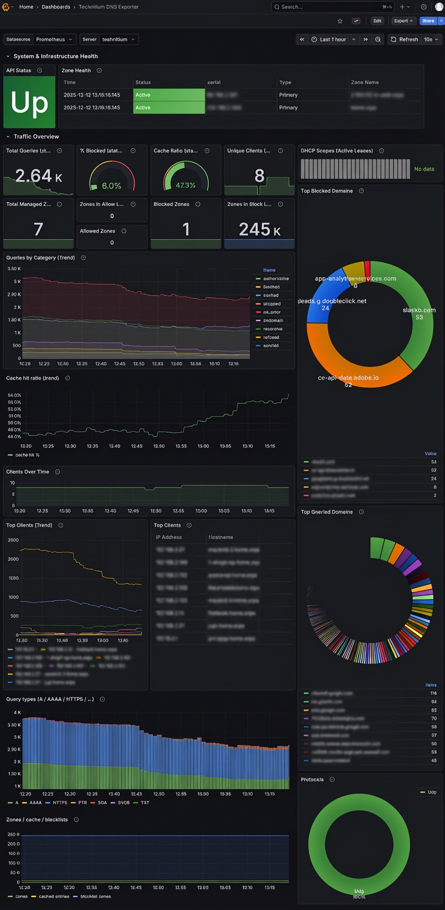

# Technitium DNS Prometheus Exporter

A lightweight [Prometheus](https://github.com/prometheus/prometheus) exporter for [Technitium DNS Server](https://technitium.com/dns/) ([github](https://github.com/TechnitiumSoftware/DnsServer)) that exposes dashboard, DNS, zone, DHCP, and top‑query statistics for **single servers or clusters**. Includes an [accompanying dashboard](https://grafana.com/grafana/dashboards/24555-technitium-dns-exporter/) for visualization in [Grafana](https://grafana.com/) and a ready-made set of [Prometheus alerting rules](prometheus/technitium-dns-alerts.yaml).


Inspired by [pihole-exporter](https://github.com/eko/pihole-exporter) and [Pi-hole Exporter Grafana dashboard](https://grafana.com/grafana/dashboards/10176-pi-hole-exporter/). After migrating from Pi-hole to Technitium, I couldn’t find any exporter that provided the metrics I needed while remaining simple and reliable — so I built one.

## Design Notes

- **Realtime and Window-based metrics**: Supports monotonic counters since server start (`Realtime Metrics`) from Technitium's v15 and window based metrics (`Traffic Overview`)
- **Cluster-Aware**: Can monitor a complete Technitium cluster from a single exporter instance by proxying requests through the primary controller.
- No artificial counters or rate conversions
- DNS traffic metrics (`Traffic Overview`) reflect **Technitium’s current dashboard statistics window** (e.g. `LastHour`), not cumulative/lifetime counters. 
- `Realtime Metrics` show lifetime counters present in Technitium DNS v15 and up.
- API Status, Stats window, Zone and DHCP metrics reflect current server state at scrape time.
- Logging is explicit on API failures
- Metric cardinality is intentionally bounded
- Suitable for home labs and small/medium installations. Use of python over golang comes from the need for a quick and easy to understand solution without the need to define specific golang structs for each Technitium DNS API output, which could change any time and break strict typing.

---


## Configuration

All configuration is done via environment variables.

| Variable | Description | Default |
|--------|-------------|---------|
| `TECHNITIUM_BASE_URL` | Base URL of Technitium DNS API  (the controller if using clustering) | `http://technitium:5380` |
| `TECHNITIUM_TOKEN` | **Required** API token | _(none)_ |
| `TECHNITIUM_VERIFY_SSL` | SSL Verification (set to "false" if using self-signed certs) | `true` |
| `TECHNITIUM_STATS_RANGE` | Stats window (The duration type for which valid values are: `LastHour`, `LastDay`, `LastWeek`, `LastMonth`, `LastYear`, `Custom`. ) | `LastHour` |
| `TECHNITIUM_TOP_LIMIT` | Number of entries in Top lists (Clients/Domains). | `50` |
| `EXPORTER_PORT` | Port exporter listens on | `9105` |
| `LOG_LEVEL` | Logging level | `INFO` |
| `SERVER_LABEL` | **Single Mode:** Custom label for the server tag in Grafana. | `technitium` |
| `TECHNITIUM_NODES` | **Cluster Mode:** Comma-separated list of node names to scrape (optional). | _(unset)_ |

### Deployment Modes

The exporter supports two modes of Technitium DNS operation: single server and clustering.

#### Single Server Mode (default)

If `TECHNITIUM_NODES` is left empty, the server label in Prometheus/Grafana will be set to the value of `SERVER_LABEL` (default: `technitium`).

#### Clustering Mode

If you are running a Technitium cluster, you only need one exporter instance.

Point `TECHNITIUM_BASE_URL` to your primary controller.
Set `TECHNITIUM_NODES` to a comma-separated list of the node names exactly as they appear in your Technitium panel.

Example: `TECHNITIUM_NODES="primary-node,secondary-01,secondary-02"`

The exporter will iterate through this list, asking the Controller to proxy requests to each node.
Metrics will be tagged automatically: server="primary-node", server="secondary-01", etc.

Note: `SERVER_LABEL` is ignored in this mode.

 

### Creating the Technitium DNS API token

The exporter needs a read-only API token to talk to Technitium DNS server. 

Here’s only way I am aware of to generate one:
- Open your Technitium instance in a browser.
- Navigate to Administration > Groups and create a group named “read-only”.
- Now create a user named “readonly” and make it a member of "read-only" group.
- Go to Administration > Permissions and verify that Everyone has read-only access to everything.
- Go to Zones > select zone > Permissions, 
  - In Group Permissions > add group "read-only", Assign View permission to "read-only" group and click Save
  - Repeat for all Zones you wish to export
- Log out of Technitium. Log back in as the readonly user you just created.
- Click on readonly user's profile in the top-right corner and select “Create API token”.


---

## Running with Docker Compose

### With prebuild iamge

Available images are:
- linux/amd64
- linux/arm64
- linux/arm/v7

Example `docker-compose.yml` for single Technitium instance :

```yaml
  technitium_exporter:
    image: ghcr.io/guycalledseven/technitium-dns-prometheus-exporter:latest
    container_name: technitium_exporter
    depends_on:
      - prometheus
    restart: unless-stopped
    environment:
      TECHNITIUM_BASE_URL: http://technitium:5380
      # TECHNITIUM_BASE_URL: https://technitium::53443
      # TECHNITIUM_VERIFY_SSL: false
      TECHNITIUM_TOKEN: your-api-token-here
      SERVER_LABEL: technitium
      TECHNITIUM_STATS_RANGE: LastHour
      TECHNITIUM_TOP_LIMIT: 50
      EXPORTER_PORT: 9105
    ports:
      - "9105:9105"
```

Example for Technitium DNS cluster:

```yaml
  technitium_exporter:
    image: ghcr.io/guycalledseven/technitium-dns-prometheus-exporter:latest
    container_name: technitium_exporter
    depends_on:
      - prometheus
    restart: unless-stopped
    environment:
      TECHNITIUM_BASE_URL: https://technitium:5380 # your controller
      TECHNITIUM_VERIFY_SSL: false # eg. has self signed cert
      TECHNITIUM_TOKEN: your-api-token-here
      TECHNITIUM_NODES: "primary-node,secondary-01,secondary-02" # your nodes
      TECHNITIUM_STATS_RANGE: LastHour
      TECHNITIUM_TOP_LIMIT: 50
      EXPORTER_PORT: 9105
    ports:
      - "9105:9105"
```


### Prometheus scrape config:

```yaml
scrape_configs:
  - job_name: technitium
    static_configs:
      - targets:
          - technitium-exporter:9105
```

---


## Features

> ⚠️ **Important:** As of version 2.0.0 the exporter provides two categories of DNS traffic metrics:
> 1. **Window-based snapshots** (default from Technitium's `/api/dashboard/stats/get`) — reflect the selected stats window (e.g., `LastHour`). Values may increase or decrease as the window slides.
> 2. **Lifetime counters** (from Technitium's v15.0.0 `/api/dashboard/metrics/text` newly added endpoint) — monotonic counters since server start.


### Window-based DNS Traffic Metrics

These metrics come from `/api/dashboard/stats/get` and `/api/dashboard/stats/getTop` and represent “stats over the last X”:

- `technitium_dns_queries_window{server, category}`
- `technitium_dns_response_type_total{server, type}`
- `technitium_dns_query_type_total{server, qtype}`
- `technitium_dns_protocol_queries{server, protocol}`
- `technitium_dns_top_domain_hits{server, domain}`
- `technitium_dns_top_blocked_domain_hits{server, domain}`
- `technitium_dns_top_client_hits{server, client_ip, client_name}`
- `technitium_dns_clients_window{server}`

Use these for:
- % blocked
- Cache hit ratio — see note below
- Query mix breakdown
- Error & NXDOMAIN analysis
- Top talkers and Pi-hole-style dashboards

> **Cache hit ratio formulas:** The dashboard provides two complementary metrics:
> - **Gauge (id:20):** `cached / all` — what fraction of *all* DNS traffic was served from cache
> - **Trend (id:34):** `Cached / (Cached + Recursive)` — how effective the cache was for resolver-dependent queries specifically (excludes authoritative, blocked, dropped)

### Snapshot-of-State Metrics (Inventory / Configuration)

These reflect the **current state of the DNS server**, unaffected by the stats window:

- `technitium_dns_zones{server}`
- `technitium_dns_cached_entries{server}`
- `technitium_dns_allowed_zones{server}`
- `technitium_dns_manual_blocked_zones{server}`
- `technitium_dns_allowlist_zones{server}`
- `technitium_dns_blocklist_zones{server}`
- `technitium_zone_info{server, zone, type, disabled, internal, serial}`
- `technitium_dhcp_leases_total{server, scope, type}`

Use these for:
- Zone inventory and health
- Blocklist/allowlist statistics (`_manual_blocked_zones` = user-added, `_blocklist_zones` = imported via blocklists)
- Cache size monitoring
- DHCP scope usage

### Lifetime Counter Metrics (Realtime)

These metrics are **monotonic lifetime counters** since server start (available from Technitium DNS v15):

- `technitium_realtime_uptime_seconds{server}` — seconds since server start (gauge)
- `technitium_realtime_start_time_seconds{server}` — server start epoch in seconds (gauge)
- `technitium_realtime_clients_total{server}` — total unique clients since server start (gauge)
- `technitium_dns_realtime_queries_total{server, category}` — lifetime query counters (counter)

Categories:
```
all           no_error         servfail
nxdomain      refused          authoritative
recursive     cached           blocked
dropped
```

Use these for:
- Queries/sec throughput 
- Cache hit ratio 
- Block ratio 
- True query rate by category
- Server uptime and start time monitoring

### Exporter & Health Metrics

Exporter + API health:

- `technitium_up{server}` — API reachability (0/1)
- `technitium_stats_range_info{server, range}` — configured stats window (e.g. LastHour, LastDay)
- `technitium_scrape_duration_seconds{server}` — exporter scrape duration

Python client process metrics:

- `python_gc_*`
- `python_info`

## Metrics Overview

### Core Health

- `technitium_up{server}`
- `technitium_scrape_duration_seconds{server}`

### DNS Queries (Window Snapshot)

- `technitium_dns_queries_window{server, category}`

Categories:
```
all
no_error
nxdomain
servfail
refused
authoritative
recursive
cached
blocked
dropped
```

### Breakdown Metrics

- `technitium_dns_response_type_total{server, type}`
- `technitium_dns_query_type_total{server, qtype}`
- `technitium_dns_protocol_queries{server, protocol}`

### Top Lists

- `technitium_dns_top_client_hits{server, client_ip, client_name}`
- `technitium_dns_top_domain_hits{server, domain}`
- `technitium_dns_top_blocked_domain_hits{server, domain}`

### Zones

- `technitium_zone_info{server, zone, type, disabled, internal, serial}`
- `technitium_dns_zones{server}`
- `technitium_dns_allowed_zones{server}`
- `technitium_dns_manual_blocked_zones{server}`
- `technitium_dns_allowlist_zones{server}`
- `technitium_dns_blocklist_zones{server}`
- `technitium_dns_cached_entries{server}`

### DHCP

- `technitium_dhcp_leases_total{server, scope, type}`

### DNS Queries (Lifetime Counters — Realtime)

- `technitium_dns_realtime_queries_total{server, category}`

### Server Lifetime

- `technitium_realtime_uptime_seconds{server}`
- `technitium_realtime_start_time_seconds{server}`

### Realtime Clients

- `technitium_realtime_clients_total{server}`


---

## Roadmap

- Per‑client block rate
- Per‑zone query statistics
- DNSSEC / DoH / DoT breakdowns
- Rate‑limited client metrics
- Optional caching layer to reduce API calls?

### Updates in v2.0.1
- Update of realtime metric names for Technitium DNS v15.1 ([changelog](https://github.com/TechnitiumSoftware/DnsServer/blob/master/CHANGELOG.md#version-151))

### Updates in v2.0.0
- **Realtime lifetime metrics** — `technitium_dns_realtime_queries_total`, `technitium_realtime_uptime_seconds`, `technitium_realtime_start_time_seconds` from `/api/dashboard/metrics/text`
- **Realtime Grafana panels** — QPS, cache hit %, block %, uptime, lifetime clients in a dedicated dashboard row


## Alerting rules

A curated set of alerting rules ships in [`prometheus/technitium-dns-alerts.yaml`](prometheus/technitium-dns-alerts.yaml). Load it into Prometheus via `rule_files:` (see below), **or** import the same file into Grafana-managed alerting (*Alerting → Alert rules → Import to Grafana-managed rules*, Grafana 12+) — pick one, not both, or every alert evaluates and fires twice.

### What's in it

| Alert | Severity | Fires when |
|---|---|---|
| `TechnitiumExporterDown` | critical | Prometheus can't scrape the exporter for 5 min |
| `TechnitiumTargetMissing` | critical | No `technitium.*` scrape target exists in Prometheus at all |
| `TechnitiumApiUnreachable` | critical | Exporter runs, but the Technitium API stops answering for a server |
| `TechnitiumRealtimeMetricsMissing` | critical | Realtime lifetime counters vanish fleet-wide while the API still answers |
| `TechnitiumRealtimeMetricsMissingOnNode` | critical | A single server's realtime counters go missing while its API answers — catches per-node failures in **cluster mode** that the fleet-wide rule can't see |
| `TechnitiumExporterScrapeSlow` | warning | Scrape duration exceeds 5 s for 15 min (halfway to the default scrape timeout) |
| `TechnitiumNoQueries` | critical | A server answers the API but serves zero DNS queries for 30 min |
| `TechnitiumHighServfailRate` | critical | More than 3% of queries SERVFAIL for 10 min (guarded against post-restart spikes) |
| `TechnitiumBlockListCollapsed` | warning | Block list drops below half its 7-day peak |
| `TechnitiumBlockListShrinking` | info | Block list sits 10–50% below its 7-day peak for 6 h |

### Before enabling 

Check:

1. **Job name.** Every rule matches `job=~"technitium.*"`. If your scrape job is named differently, adjust either the job or the rules.
2. **One exporter per job.** Aggregations use `by (job, server)`. If several exporter instances share one job name, add `instance` to every `by (...)` clause or the rules will collapse them into each other.

### Installing

Copy the file next to your `prometheus.yml` and reference it:

```yaml
rule_files:
  - 'technitium-dns-alerts.yaml'
```

Then reload Prometheus — either restart it, or if it runs with `--web.enable-lifecycle`:

```bash
curl -X POST http://localhost:9090/-/reload
```

Verify the three groups (`technitium-availability`, `technitium-resolution`, `technitium-blocking`) appear under `http://localhost:9090/rules`. You can validate the file beforehand without installing anything:

```bash
docker run --rm --entrypoint /bin/promtool \
  -v "$PWD/prometheus/technitium-dns-alerts.yaml:/rules.yaml:ro" \
  prom/prometheus:latest check rules /rules.yaml
```

### Notes

- Rules alone don't notify anyone: pair Prometheus with an Alertmanager, or use Grafana-managed alerting with a contact point.
- Each rule carries a custom `action` annotation with concrete first debugging steps. Default notification templates don't render it — add `{{ .Annotations.action }}` to yours.
- Requires Prometheus ≥ 2.42 (the file uses `keep_firing_for`).

---


## Accompanying Grafana dashboard

Available in [repo](grafana/technitium-dns-grafana-dashboard.json) and [Grafana dashboards](https://grafana.com/grafana/dashboards/24555-technitium-dns-exporter/).




## License

Apache License 2.0

---